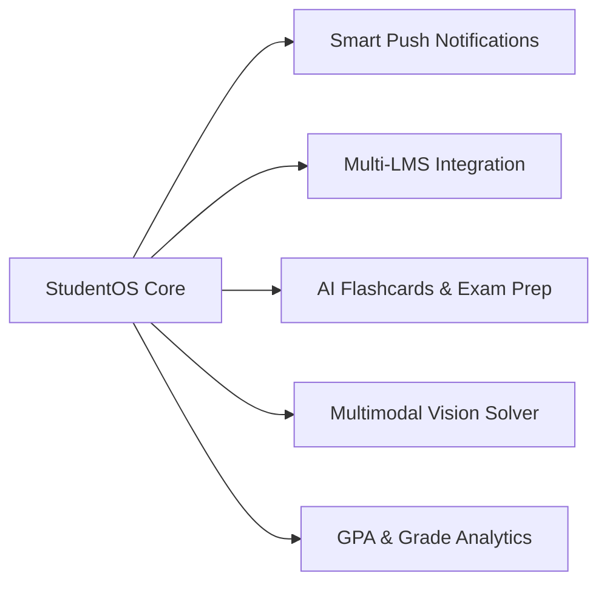

# 🎓 Student OS v4

> **An LLM-Powered Autonomous Agent System for Managing Academic Timetables, Google Classroom, and Student Emails.**

<p align="center">
  
  
  
  
  
  
  
  
  
</p>

---

## 🌟 Overview

**Student OS** is an intelligent, multi-agent AI assistant designed to streamline academic workflows for university students. Powered by **FastAPI**, **LangGraph Orchestrator**, and a **ChatGPT-inspired React Native frontend**, Student OS enables students to check class schedules, query Google Classroom assignments, search emails, and manage coursework using natural conversational language.

---

## ✨ Key Features & Capabilities

- 🎨 **ChatGPT-Inspired Dark UI/UX**:
  - Cosmic orbital visual themes with dark cyberpunk styling (`#0A0914`, `#10A37F`).
  - Interactive **Burger Menu Drawer** (`☰`) for navigation, Kolkata IST real-time clock, server health check, and session controls.
  - **Animated Token Streaming Cursor (`▋`)** and pulsing thinking indicator.
  - Floating pill input bar (`border-radius: 26px`), quick suggestion chips, and disclaimer footer.

- 🔒 **Persistent Authentication Session**:
  - Powered by `@react-native-async-storage/async-storage` on iOS, Android, and Web (`localStorage`).
  - Students remain signed in automatically across app restarts until they explicitly tap **Sign Out**.

- 🔗 **Direct Redirect Links**:
  - **Gmail Email Links**: Every returned email includes a direct clickable markdown link (`[Open in Gmail](url)`) that opens the target email thread in Gmail.
  - **Google Classroom Links**: Every coursework item, course, or announcement includes a direct clickable markdown link (`[Open in Classroom](url)`) opening the item in Google Classroom.

- 📚 **Google Classroom Agent**:
  - Query enrolled courses, syllabus, and course codes.
  - Fetch upcoming assignments, pending homework, due date alerts, submission grades, and announcements.

- ✉️ **Gmail Assistant**:
  - Search unread emails, query relative time ranges (*"last 5 hours"*, *"yesterday"*), read full email threads, and draft/send emails.

- 📅 **Timetable & Academic Schedule**:
  - Daily schedule queries for any weekday with location/room numbers.
  - Explicit **Lunch Break (13:30 – 14:30 IST)** tracking across all weekdays.

---

## 🏗️ Architecture & Backend Concepts

```text
┌────────────────────────────────────────────────────────┐
│  React Native / Expo Frontend (Android, iOS & Web)     │
│  - SSE Parser (chatStream.js) & Thread Session Engine  │
│  - Persistent AsyncStorage & Deep Link OAuth Handler   │
└───────────────────────────┬────────────────────────────┘
                            │  HTTP / SSE Stream (/chat/stream)
                            ▼
┌────────────────────────────────────────────────────────┐
│  Python FastAPI Server (main.py)                        │
│  - Real-time StreamingResponse & Pydantic Validation   │
└───────────────────────────┬────────────────────────────┘
                            │  LangGraph StateGraph & Checkpointer
                            ▼
┌────────────────────────────────────────────────────────┐
│  LangGraph Orchestrator Agent (backend/state.py)       │
│  ├─► Classroom Agent (Google Classroom API v1)          │
│  ├─► Email Agent (Gmail API v1)                         │
│  ├─► Timetable Agent (JSON Academic Schedule Data)      │
│  └─► General Assistant (Fallback Knowledge Node)       │
└────────────────────────────────────────────────────────┘
```

### Backend Engineering Highlights (`backend.md`)
1. **Server-Sent Events (SSE) Streaming**: `StreamingResponse` using LangGraph's `astream_events(version="v2")` streams AI responses token-by-token alongside live tool execution status badges (`⚡ search_emails`, `⚡ get_upcoming_assignments`).
2. **LangGraph Multi-Agent Routing**: Central Router Agent inspects conversation history and dynamically routes queries to specialized sub-agents (`Email`, `Classroom`, `Timetable`, `General`).
3. **Google API Security & Headless Support**: OAuth 2.0 token management supporting interactive desktop flows as well as headless server environments (Render environment variables `CLASSROOM_OAUTH_TOKEN_JSON` and `EMAIL_OAUTH_TOKEN_JSON`).
4. **Asia/Kolkata Timezone Engine**: Converts raw UTC timestamps into student local IST times (`YYYY-MM-DD hh:mm AM/PM`) and parses relative time expressions (*"5 hours ago"*).

---

## 📱 Frontend Architecture & UI Breakdown

### Frontend Engineering Highlights (`frontend.md`)
1. **Cross-Platform React Native & Expo**: Single codebase running on Android, iOS, and Web via `react-native-web`.
2. **Custom SSE Stream Parser (`chatStream.js`)**: Consumes chunk streams and tool events without external websocket dependencies.
3. **Rich Markdown & Table Renderer (`MessageItem.js`)**:
   - `react-native-markdown-display` with custom rules wrapping wide tables in horizontal `ScrollView` containers.
   - `Linking.openURL(url)` handler for interactive redirect links.
   - Animated blinking cursor (`BlinkingCursor`) and thinking pulse dots (`ThinkingIndicator`).

---

## 📁 Repository Structure

```text
StudentOS/
├── FastAPI/                    # FastAPI Backend Application
│   ├── main.py                 # Application entry point & CORS
│   └── router/                 # API routers
│       ├── chat.py             # Server-Sent Events (SSE) streaming endpoint
│       ├── setup.py            # OAuth verification & setup status routes
│       └── schema.py           # Pydantic data models
├── backend/                    # LangGraph Agent Orchestrator & Tools
│   ├── state.py                # AgentState & System Prompts
│   ├── config.py               # LLM configuration (Groq / Llama 3.3)
│   └── agents/
│       ├── orchastetor/        # Graph routing logic
│       ├── classroom/          # Classroom tools & graph
│       ├── email/              # Gmail tools & graph
│       └── timetable/          # Timetable tools & graph
├── data/                       # Credentials, Tokens & Datasets
│   ├── timetable.json          # Weekly academic schedule dataset
│   ├── email_oauth_credentials.json
│   ├── email_oauth_token.json
│   ├── classroom_oauth_credentials.json
│   └── classroom_oauth_token.json
├── frontend/                   # React Native / Expo Frontend
│   ├── App.js                  # Main chat app entry point
│   ├── app.json                # Expo configuration
│   ├── eas.json                # Expo EAS Build config (Android APK)
│   ├── assets/                 # App logo, icons & favicons
│   └── src/
│       ├── components/         # Header, MessageItem, ChatInput, SidebarDrawer, SetupModal, LoginScreen
│       ├── services/           # Chat SSE stream, Storage, Auth & Setup API handlers
│       └── theme/              # Dark theme color tokens
├── scripts/                    # Management Scripts
│   └── authenticate_oauth.py   # CLI OAuth sign-in & token generator
└── requirements.txt            # Python dependencies
```

---

## 🚀 Quick Start & Local Setup

### Step 1: Set Up Backend

1. Clone repository and install dependencies:
   ```bash
   git clone https://github.com/SumiRann1/StudentOS.git
   cd StudentOS
   pip install -r requirements.txt
   ```

2. Configure Environment Variables (`.env` in root):
   ```env
   GROQ_API_KEY=your_groq_api_key_here
   ```

---

### Step 2: Authenticate Google OAuth Services

Place `email_oauth_credentials.json` and `classroom_oauth_credentials.json` in `data/`, then run:

```bash
# Authenticate Google Classroom
python scripts/authenticate_oauth.py --service classroom

# Authenticate Gmail Service
python scripts/authenticate_oauth.py --service email

# Verify token status
python scripts/authenticate_oauth.py --check
```

---

### Step 3: Launch FastAPI Backend Server

```bash
uvicorn FastAPI.main:app --reload --host 0.0.0.0 --port 8000
```
Verify interactive docs at `http://localhost:8000/docs`.

---

### Step 4: Launch React Native Frontend

```bash
cd frontend
npm install

# Start Expo dev server (Scan QR code in Expo Go app)
npx expo start

# Or run in web browser
npx expo start --web
```

---

## ⚡ Recommended Improvements & Future Roadmap



### ⚡ Recommended Immediate Enhancements
1. **Persistent Chat History**: Store past conversation threads in local storage / SQLite so students can reload previous chats.
2. **Offline Local Caching**: Cache lecture schedules and pending assignments so students can check deadlines without campus Wi-Fi.
3. **RAG (Retrieval-Augmented Generation)**: Vector database (**ChromaDB** / **Qdrant**) to index uploaded lecture slides and syllabus PDFs.
4. **Background Sync Worker**: Scheduled background worker (**Celery** / **APScheduler**) to periodically sync emails and assignments.

### 🚀 Future Feature Expansion Roadmap
- **Phase 1: Smart Push Notifications (`expo-notifications`)**: Lecture alerts 15m prior; deadline warnings 24h & 3h prior.
- **Phase 2: Multi-LMS Integration**: Connectors for **Canvas LMS**, **Moodle**, **Blackboard**, and **Piazza**.
- **Phase 3: Multimodal Vision Homework Assistant**: Solve textbook equations & lab diagrams from photos.
- **Phase 4: AI Flashcard & Quiz Generator**: Spaced-repetition study flashcards automatically generated from coursework.
- **Phase 5: Grade Predictor & GPA Analytics**: Course grade tracking and target final exam score estimation.

---

## 📄 License

This project is licensed under the **MIT License**.
