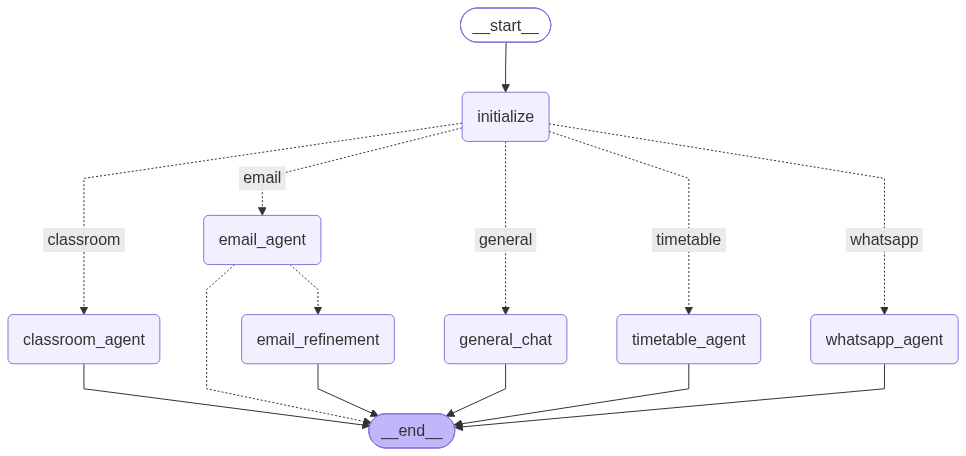

# 🎓 StudentOS
[](https://langchain.com/)
[](https://langchain-ai.github.io/langgraph/)
[](https://streamlit.io/)
[](https://web.whatsapp.com/)
[](https://mail.google.com/)
[](https://classroom.google.com/)

StudentOS is an intelligent, unified university assistant designed to consolidate and simplify a student's academic life. Powered by a multi-agent **LangGraph** orchestrator, it integrates multiple communication feeds and academic databases—**WhatsApp Web**, **Gmail**, **Google Classroom**, and **Course Timetables**—into a single portal.

It features a high-end, responsive **Streamlit Web UI** designed with dark mode glassmorphism, responsive data representation, and dynamic routing indicators.

## 📊 Orchestrator Agent Graph
Below is the compiled LangGraph architecture of StudentOS showing the initialization, LLM routing, sub-agent execution steps, and email post-condition checking:



---

## 🚀 Features

### 🧠 Master Agent Router
- Automatically analyzes user requests and routes them to specialized sub-agents based on intent.
- Maintains conversation history across modules using LangGraph persistent memory.

### 📱 WhatsApp Web Assistant
- Uses Playwright browser automation to connect securely to WhatsApp.
- Retrieves active chat lists, reads message logs, drafts/sends messages, and creates structured chat summaries.

### ✉️ University Email Assistant
- Integrates with the Gmail API to search, read, compose, send, and reply to emails.
- Automatically handles, downloads, and catalogues email attachments.

### 📅 Timetable Assistant
- Connects to the local courses database to list schedules, lecturers, course credits, and locations.

### 🏫 Google Classroom Assistant
- Connects to the Classroom API to list active courses, upcoming assignments with due dates, announcement logs, and coursework grades.

---

## 📁 Repository Structure

```text
StudentOS/
├── backend/
│   ├── agents/
│   │   ├── classroom/         # Google Classroom agent nodes and tools
│   │   ├── email/             # Gmail agent nodes and tools
│   │   ├── timetable/         # Timetable query nodes and tools
│   │   ├── whatsapp/          # Playwright WhatsApp automation client and tools
│   │   ├── orchestrator.py    # Master router graph construction
│   │   ├── state.py           # Shared LangGraph AgentState TypedDict
│   │   └── test_orchestrator.py # CLI interactive test script
│   ├── config.py              # LLM and global bindings configuration
│   └── main.py                # Timetable tester
├── frontend/
│   ├── app.py                 # Streamlit web app
│   └── style.css              # Custom stylesheet with mobile responsive rules
├── data/                      # Local data cache folder (ignored in git)
│   ├── attachments/           # Downloaded email attachments
│   ├── whatsapp_session/      # Playwright Chrome session cache
│   └── timetable.json         # Local course and timetable database
├── .streamlit/
│   └── config.toml            # Purple dark-theme config overrides
├── .env                       # API keys and environment variables (ignored in git)
├── .gitignore                 # Safe git push exclusion guidelines
└── requirements.txt           # Python dependency specifications
```

---

## 🛠️ Installation & Setup

### 1. Clone the Repository
```bash
git clone <your-repository-url>
cd StudentOS
```

### 2. Install Dependencies
Make sure you are in your active Python environment, then run:
```bash
pip install -r requirements.txt
```

### 3. Install Playwright Browsers
To enable WhatsApp automation, fetch playwight's chromium dependencies:
```bash
playwright install chromium
```

### 4. Setup Environment Variables
Create a `.env` file in the project root and provide your API keys:
```env
GROQ_API_KEY=your_groq_api_key
```

### 5. Google API Credentials
For the **Email** and **Classroom** agents, place your client secrets file at:
- `backend/agents/email/credentials.json`
- `backend/agents/classroom/credentials.json`

On your first run, a local server will open in the browser to authorize scopes, saving authentication states to `token.json` files automatically.

---

## 🏃 Running the Application

### Option A: Running the Web UI Portal (Recommended)
Launch the responsive Streamlit dashboard:
```bash
streamlit run frontend/app.py
```
Open `http://localhost:8501` in your browser.

### Option B: Running the Interactive CLI Interface
Test the orchestrator directly in your terminal:
```bash
python backend/agents/test_orchestrator.py
```
- Type `/clear` to start a new chat session (resets history).
- Type `exit` to close.
